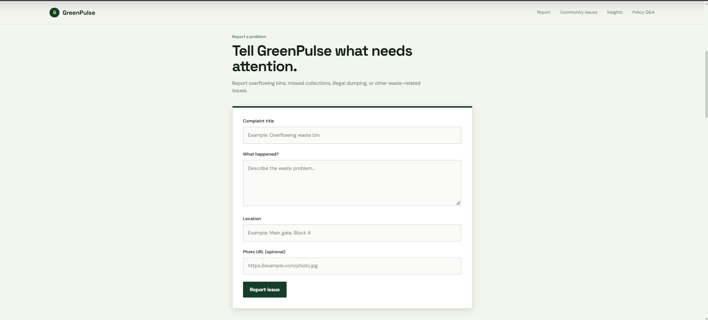
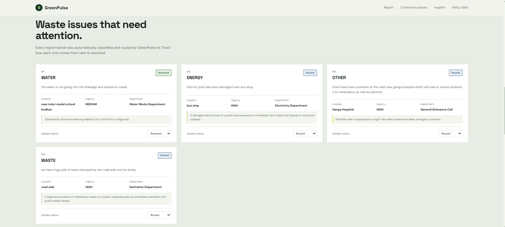
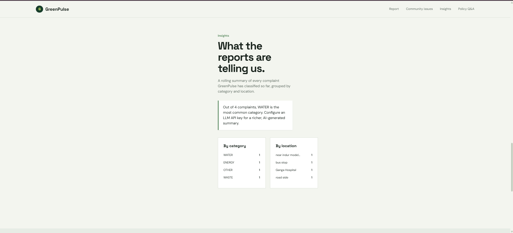
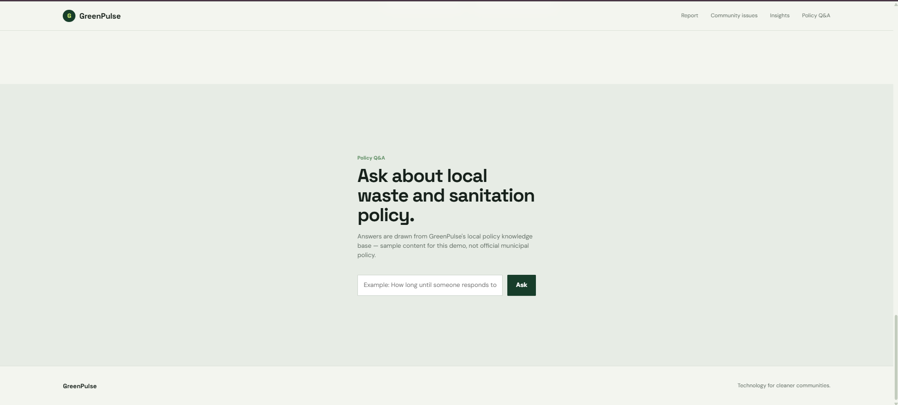

# 🌱 GreenPulse — AI-Powered Civic Waste Management Platform

**Report. Analyze. Route. Resolve.**

GreenPulse is an AI-powered civic waste-complaint platform that helps citizens report waste-management issues and enables faster, smarter routing of complaints. Citizens submit a complaint with a description, a location hint, and an optional photo URL. The Spring Boot + AI backend then analyzes it, automatically determining the **category**, **urgency**, and **responsible department**, along with **routing reasoning**.

The platform also offers complaint status tracking, community insights and trends, and a policy Q&A assistant for waste-management questions.

> **Status:** 🚧 Active Development. Features, API contracts, and AI workflows may evolve.

---

## Table of Contents

- [Overview](#overview)
- [Key Features](#key-features)
- [Tech Stack](#tech-stack)
- [Architecture](#architecture)
- [Repository Structure](#repository-structure)
- [Getting Started](#getting-started)
- [Backend Configuration](#backend-configuration)
- [API Reference](#api-reference)
- [Data Compatibility](#data-compatibility)
- [CORS Configuration](#cors-configuration)
- [Environment Variables & Secrets](#environment-variables--secrets)
- [Development Workflow](#development-workflow)
- [Troubleshooting](#troubleshooting)
- [Screenshots](#screenshots)
- [Future Enhancements](#future-enhancements)
- [Responsible AI Considerations](#responsible-ai-considerations)
- [Sustainability & SDG Alignment](#sustainability--sdg-alignment)
- [Contributing](#contributing)
- [Issue Reporting](#issue-reporting)
- [License](#license)
- [Acknowledgements](#acknowledgements)
- [Author](#author)

---

## Overview

Traditional civic complaint systems often rely on manual categorization and routing, which delays issue resolution. GreenPulse uses AI-assisted classification to turn an unstructured citizen complaint into actionable information:

```text
Citizen Complaint
       │
       ▼
┌─────────────────────┐
│   React Frontend    │
│      + Vite         │
└─────────┬───────────┘
          │ REST API
          ▼
┌─────────────────────┐
│   Spring Boot API   │
└─────────┬───────────┘
          │
          ▼
┌─────────────────────┐
│    AI Processing    │
│                     │
│ • Category          │
│ • Urgency           │
│ • Department        │
│ • AI Reasoning      │
└─────────┬───────────┘
          │
          ▼
┌─────────────────────┐
│      MySQL DB       │
└─────────┬───────────┘
          │
          ▼
Complaint Tracking & Community Insights
```

---

## Key Features

### 📝 Complaint Submission

Citizens can submit a waste-related complaint containing:

- Complaint description *(required)*
- Location hint *(optional)*
- Photo URL *(optional)*

> *"The bin near Block A has been overflowing for two days."*

### 🤖 AI-Powered Complaint Classification

For every complaint, the backend generates:

- Complaint category
- Urgency level
- Responsible department
- AI-generated routing reasoning

```text
Category:   Overflowing Bin
Urgency:    HIGH
Department: Sanitation

Reasoning:
Recurring overflow near a high-traffic area poses
a potential health and sanitation risk.
```

### 🔄 Complaint Status Tracking

Complaints move through the following lifecycle, and users can see the current status of each complaint in the frontend:

```text
NEW → ROUTED → IN_PROGRESS → RESOLVED
```

### 🏘️ Community Complaint Dashboard

The community view displays submitted complaints in a grid showing:

- Complaint details
- AI classification
- Urgency
- Assigned department
- Current status
- Location information
- Routing reasoning

Status changes are reflected in the interface.

### 📊 Trends & Insights

The insights view helps identify recurring waste-management problems by summarizing:

- Complaint volume
- Categories
- Complaint trends
- Frequently reported waste issues

### 💬 Policy Q&A Assistant

Users can ask questions about waste-management policies. The assistant answers using the project's AI / Retrieval-Augmented Generation (RAG) workflow.

---

## Tech Stack

| Layer        | Technologies                                                            |
| ------------ | ----------------------------------------------------------------------- |
| **Frontend** | React, Vite, JavaScript, HTML5, CSS3                                    |
| **Backend**  | Java, Spring Boot, Spring Web, Spring Data JPA, REST APIs               |
| **Database** | MySQL                                                                   |
| **AI**       | Large Language Model (LLM), AI complaint classification, RAG for policy Q&A |
| **Tooling**  | Git, GitHub, Visual Studio Code, Maven, npm                             |

---

## Architecture

```text
                    ┌───────────────────┐
                    │      Citizen      │
                    └─────────┬─────────┘
                              │
                              ▼
                    ┌───────────────────┐
                    │  React + Vite UI  │
                    └─────────┬─────────┘
                              │
                         REST / JSON
                              │
                              ▼
                    ┌───────────────────┐
                    │  Spring Boot API  │
                    └───────┬───────────┘
                            │
             ┌──────────────┼──────────────┐
             │              │              │
             ▼              ▼              ▼
       ┌──────────┐   ┌──────────┐   ┌──────────┐
       │    AI    │   │  MySQL   │   │   RAG    │
       │ Analysis │   │ Database │   │ Pipeline │
       └──────────┘   └──────────┘   └──────────┘
             │              │              │
             └──────────────┼──────────────┘
                            ▼
                    ┌───────────────────┐
                    │ Complaint Results │
                    │    & Insights     │
                    └───────────────────┘
```

---

## Repository Structure

```text
GreenPulse/
│
├── src/
│   ├── components/
│   │   ├── ComplaintCard.jsx
│   │   ├── ComplaintForm.jsx
│   │   └── ComplaintList.jsx
│   │
│   ├── services/
│   │   ├── apiConfig.js
│   │   └── complaintApi.js
│   │
│   ├── App.jsx
│   ├── main.jsx
│   └── ...
│
├── public/
│
├── .gitignore
├── package.json
├── package-lock.json
├── vite.config.js
└── README.md
```

> The structure may evolve as features such as insights and policy Q&A are added.

---

## Getting Started

### Prerequisites

Make sure the following are installed:

- Node.js and npm
- Java JDK
- Maven
- MySQL
- Git

Verify Node.js and npm:

```bash
node --version
npm --version
```

### Quick Start

```bash
# 1. Clone the repository
git clone https://github.com/vivekram17/GreenPulse.git
cd GreenPulse

# 2. Install dependencies
npm install

# 3. Start the frontend
npm run dev
```

| Service  | URL                     |
| -------- | ----------------------- |
| Frontend | `http://localhost:5173` |
| Backend  | `http://localhost:8080` |

> ⚠️ Make sure the Spring Boot backend and MySQL are running before submitting or loading complaints.

---

## Backend Configuration

GreenPulse expects the Spring Boot backend at `http://localhost:8080`. The backend URL is configured in:

```text
src/services/apiConfig.js
```

```javascript
const API_BASE_URL = "http://localhost:8080";
```

For production, avoid hard-coding the URL. Use a Vite environment variable instead:

```env
VITE_API_BASE_URL=http://localhost:8080
```

```javascript
const API_BASE_URL =
  import.meta.env.VITE_API_BASE_URL || "http://localhost:8080";
```

In production, set `VITE_API_BASE_URL` (for example `https://your-backend-domain.example`) through your hosting platform's environment-variable settings.

---

## API Reference

### Complaint Endpoints

| Method  | Endpoint                      | Purpose                       |
| ------- | ----------------------------- | ----------------------------- |
| `POST`  | `/api/complaints`             | Submit a complaint            |
| `GET`   | `/api/complaints`             | Retrieve all complaints       |
| `GET`   | `/api/complaints/{id}`        | Retrieve a specific complaint |
| `PATCH` | `/api/complaints/{id}/status` | Update complaint status       |

> Additional endpoints are required for **Trends / Insights** and **Policy Q&A**. Exact paths should match your Spring Boot controllers.

### Submit a Complaint

```http
POST /api/complaints
Content-Type: application/json
```

```json
{
  "description": "The bin near Block A has been overflowing for two days.",
  "locationHint": "Block A",
  "photoUrl": "https://example.com/photo.jpg"
}
```

`description` is **required**. `locationHint` and `photoUrl` are **optional**.

### Example Response

```json
{
  "id": 1,
  "description": "The bin near Block A has been overflowing for two days.",
  "locationHint": "Block A",
  "photoUrl": "https://example.com/photo.jpg",
  "category": "Overflowing Bin",
  "urgency": "HIGH",
  "department": "Sanitation",
  "aiReasoning": "Recurring overflow near a high-traffic area poses a health risk.",
  "status": "NEW",
  "createdAt": "2026-09-18T10:15:00Z"
}
```

### Update Complaint Status

```http
PATCH /api/complaints/{id}/status
Content-Type: application/json
```

```json
{
  "status": "IN_PROGRESS"
}
```

Supported statuses: `NEW`, `ROUTED`, `IN_PROGRESS`, `RESOLVED`.

---

## Data Compatibility

If your Spring Boot DTOs use different property names, update the frontend service layer. The main file to check is:

```text
src/services/complaintApi.js
```

Its `normalizeComplaint()` function converts backend responses into the format the React components expect. These components may also need updates:

```text
src/components/ComplaintForm.jsx
src/components/ComplaintCard.jsx
```

---

## CORS Configuration

During local development, the Spring Boot backend must allow requests from the Vite dev server. Create:

```text
src/main/java/com/greenpulse/api/config/CorsConfig.java
```

```java
package com.greenpulse.api.config;

import org.springframework.context.annotation.Bean;
import org.springframework.context.annotation.Configuration;
import org.springframework.web.servlet.config.annotation.CorsRegistry;
import org.springframework.web.servlet.config.annotation.WebMvcConfigurer;

@Configuration
public class CorsConfig {

    @Bean
    public WebMvcConfigurer corsConfigurer() {
        return new WebMvcConfigurer() {

            @Override
            public void addCorsMappings(CorsRegistry registry) {
                registry
                    .addMapping("/**")
                    .allowedOrigins("http://localhost:5173")
                    .allowedMethods(
                        "GET",
                        "POST",
                        "PATCH",
                        "PUT",
                        "DELETE",
                        "OPTIONS"
                    )
                    .allowedHeaders("*");
            }
        };
    }
}
```

Restart the Spring Boot application after adding or changing this configuration.

> For production, replace the development origin with your actual frontend domain.

---

## Environment Variables & Secrets

**Never commit** API keys, database passwords, authentication secrets, or other sensitive configuration to GitHub. Files such as `application.properties`, `.env`, and `.env.local` should not be committed when they contain secrets. Use environment variables or your deployment platform's secret management instead.

**Backend (`application.properties`)**

```properties
spring.datasource.url=${DB_URL}
spring.datasource.username=${DB_USERNAME}
spring.datasource.password=${DB_PASSWORD}

llm.api-key=${LLM_API_KEY}
```

**`.gitignore`**

```gitignore
node_modules/
dist/
.env
.env.*
!.env.example
```

**`.env.example`** (safe to commit; never put real keys or passwords here)

```env
VITE_API_BASE_URL=http://localhost:8080
```

---

## Development Workflow

```text
1. Start MySQL
       ↓
2. Start Spring Boot backend
       ↓
3. Start React/Vite frontend
       ↓
4. Open http://localhost:5173
       ↓
5. Submit a complaint
       ↓
6. Backend performs AI analysis
       ↓
7. Complaint is stored in MySQL
       ↓
8. Frontend displays classification & status
```

---

## Troubleshooting

<details>
<summary><strong>Frontend cannot connect to backend</strong></summary>

- Check that Spring Boot is running at `http://localhost:8080`.
- Verify `src/services/apiConfig.js` contains the correct backend URL.

</details>

<details>
<summary><strong>CORS error</strong></summary>

- Verify the backend allows `http://localhost:5173`.
- Restart Spring Boot after changing the CORS configuration.

</details>

<details>
<summary><strong>Complaints are not loading</strong></summary>

1. Confirm the backend is running.
2. Confirm MySQL is running.
3. Confirm `/api/complaints` is reachable.
4. Check the browser developer console for errors.
5. Inspect requests in the browser's Network tab.
6. Make sure frontend and backend DTO field names match.

</details>

<details>
<summary><strong>AI fields are missing</strong></summary>

Verify the backend response includes `category`, `urgency`, `department`, and `aiReasoning`. If the backend uses different names, update `src/services/complaintApi.js`.

</details>

---

## Screenshots

> Add screenshots of the major application views to `docs/screenshots/`.

### Complaint Submission



### Community Dashboard



### AI Insights



### Policy Q&A



---

## Future Enhancements

- [ ] User authentication and role-based access
- [ ] Interactive map-based complaint visualization
- [ ] Image-based waste classification
- [ ] Real-time notifications
- [ ] Municipal / admin dashboard
- [ ] Advanced analytics
- [ ] Complaint prioritization
- [ ] Duplicate complaint detection
- [ ] Multilingual complaint submission
- [ ] Geolocation support
- [ ] Production-grade RAG pipeline
- [ ] Mobile application
- [ ] Containerized deployment with Docker

---

## Responsible AI Considerations

GreenPulse is an AI-*assisted* civic platform, not a system that makes final administrative decisions automatically. Key principles:

- AI-generated classifications should be reviewable.
- Users should be able to correct inaccurate information.
- Personal information should not be collected unnecessarily.
- API keys and credentials must remain private.
- AI-generated policy answers should be traceable to appropriate sources.
- Automated urgency classification should be treated as decision support.
- Production deployments should implement proper authentication, authorization, logging, validation, and rate limiting.

---

## Sustainability & SDG Alignment

GreenPulse supports broader sustainability objectives and aligns particularly with:

- **SDG 11 — Sustainable Cities and Communities**
- **SDG 12 — Responsible Consumption and Production**
- **SDG 13 — Climate Action**

By helping communities report, categorize, prioritize, and monitor waste-related problems, GreenPulse demonstrates how AI and digital civic infrastructure can support more responsive waste management.

---

## Contributing

Contributions are welcome! A typical workflow:

```bash
# Create a branch
git checkout -b feature/your-feature

# Make your changes, then stage and commit
git add .
git commit -m "Add your feature"

# Push
git push origin feature/your-feature
```

Then open a Pull Request on GitHub. Before submitting:

- Test the application locally.
- Check for console errors.
- Avoid committing secrets.
- Keep changes focused.
- Update documentation when necessary.

---

## Issue Reporting

If you find a bug or have a feature request, open an issue that includes:

- A clear title
- A description of the problem
- Steps to reproduce
- Expected vs. actual behavior
- Screenshots or logs, where applicable
- Environment information

---

## License

This project is currently available for educational and project-development purposes.

If you plan to distribute GreenPulse publicly, add an explicit open-source license (e.g., MIT or Apache-2.0) after deciding what permissions you want to grant.

---

## Acknowledgements

GreenPulse was developed as an AI-for-Sustainability project exploring the use of AI for civic waste management and community problem solving. It draws on:

- Artificial Intelligence and Large Language Models
- Retrieval-Augmented Generation (RAG)
- REST API architecture
- Full-stack web development
- Data-driven civic insights
- Sustainable development

---

## Author

**Vivek Ram Nimmalapudi**
GitHub: [@vivekram17](https://github.com/vivekram17)

---

<p align="center">
  <strong>GreenPulse</strong> — <em>Report. Analyze. Route. Resolve.</em><br/>
  An AI-powered approach to smarter community waste management.
</p>
